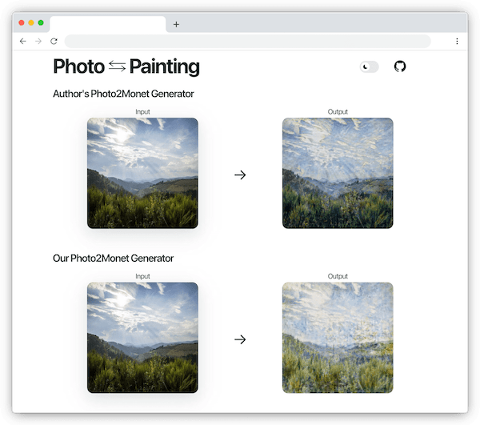

# CycleGAN Website

An interactive website to use our CycleGAN models and compare our results to the original CycleGAN authors' models.

(Screenshot generated using [BrowserFrame](https://browserframe.com/))

### Files/Folders

This website is made using [Next.js](https://nextjs.org/), a [React](https://react.dev/) framework.

- `components` - Custom [React components](https://react.dev/learn/your-first-component) that are used throughout the website.

- `pages` - [Next.js pages](https://nextjs.org/docs/basic-features/pages) which users will visit.

- `public` - Stores static assets including icons, models, etc.

- `styles` - Stylesheets used throughout the website.

- `utils` - Scripting utilities including model prediction.

- `next.config.js` - Configure ONNX runtime WebAssembly artifacts.

- `package-lock.json` - Entire dependency tree, including nested dependencies.

- `package.json` - Manage direct dependencies.

- `tsconfig.json` - Configure TypeScript compilation.

### Setup

- Install the latest version of [Node.js](https://nodejs.org/en)

- Run `npm install`

- Add the author's models in ONNX (`.onnx`) format to `/public/assets/models/authors`

  - For more information on how to export the author's models from PyTorch to ONNX, see the [ONNX wiki](https://github.com/airicbear/cis-4496-project/wiki/ONNX)

- Add our models in TensorFlow.js (`.bin` + `.json`) format to `/public/assets/models/our_model`

  - To get our models in TensorFlow.js format, see the [`save_tfjs_weights`](https://github.com/airicbear/cis-4496-project/blob/master/Code/monet_cyclegan/scripts/save_tfjs_weights.py) script

- Run `npm run dev`

- Visit [localhost:3000](http://localhost:3000/)
