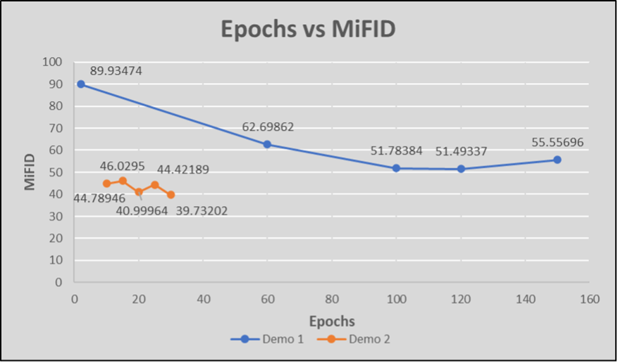
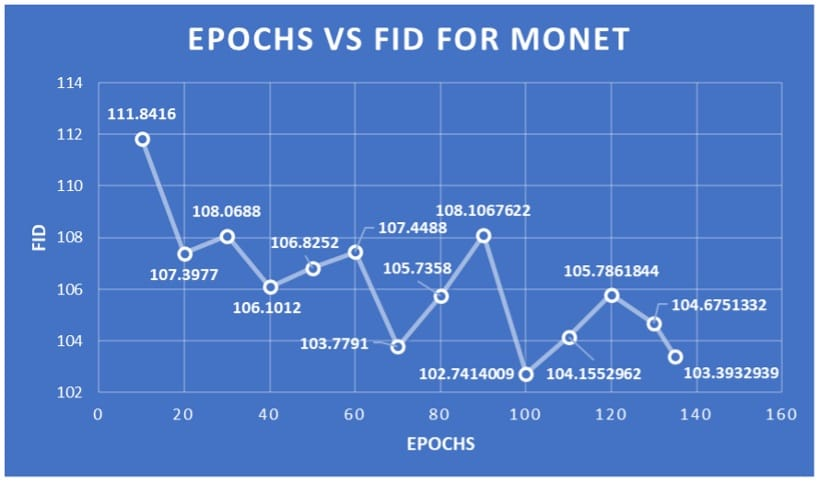
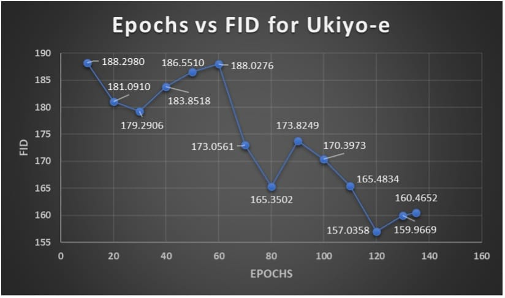
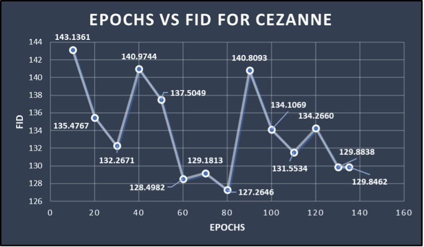
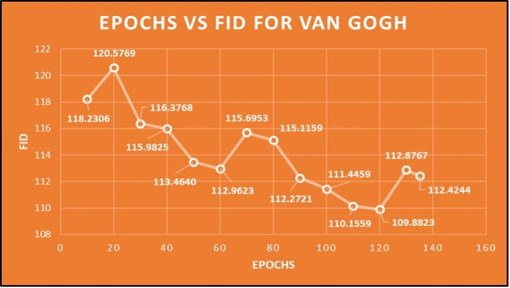

Arun Agarwal, George Aeillo, Eric Nguyen

Professor Abha Belorkar

CIS 4496 - Projects in Data Science

April 17th, 2023

# Model and Performance Report

1.  **Modeling Algorithm:**

The unique style of French painter Claude Monet, such as his color choices and brush strokes, will be imitated using Generative Adversarial Networks (GANs), which operate by training a neural network with two parts (described further in Methods).
Our task within the scope of the competition is to build a GAN that generates 7,000 to 10,000 realistic Monet-style images of dimensions 256 X 256 X 3 (RGB) (1).

A GAN (Generative Adversarial Network) is an innovative idea for generative AI, first proposed by Ian Longfellow and his corroborators in 2014 (3).
A GAN consists of two subcomponents, which are the generator and the discriminator (3).
In the initial form of GANs, the generator, _G_, takes in a random vector input, _z_, and outputs a generated value known as _G(z)_ (3).
The discriminator, _D_, takes in either a real or fake input, _x,_ and outputs a scalar probability, _D(x)_, indicating whether the input is real or fake (3).
Formally, GANs are trained by playing a two-player min-max game with a Value Function _V(G, D)_ (3).
The key discovery by Goodfellow and others is that optimizing these subcomponents concerning this min-max game creates a generator that, in theory, will produce fake inputs that look indistinguishable from real inputs (3).

(3)

However, on a more intuitive level, GANs can be described in Figure 1:

Figure 1: Diagram of GAN Process (4)

Specifically, we are using CycleGANs, a single network that uses multiple GANs to facilitate unpaired image-to-image translation.
Using the horse-to-zebra example in Figure 2, there are two generators, one generator that generates horse images and another generator that generates zebra images.
There are two discriminators, one discriminator that identifies real horse images and another discriminator that identifies real zebra images.
Similar to GANs, there is discriminator loss and generator loss.
However, the key insight of CycleGANs is the use of cycle consistency loss, in which the model ensures that the image is the same after being pushed back into different generators (7).
With regard to the Figure 2 example, it is not only generating an image of any zebra or horse but rather a translated image of the inputted zebra or horse.
It enforces this by minimizing the difference between an original horse image and the conversion of that horse image to a zebra image and the conversion of that zebra image to a horse image (7).
This innovative design leads to the wide discussion of CycleGANs in the scientific literature and its encouragement by Kaggle.
Therefore, we design our solution using CycleGANs, as opposed to other models such as neural style transfer models.
While we did look into other state-of-the-art models, such as UVCGAN, the large training times, the amount of data used, and the large quantity of time required to understand other parts of deep learning, such as vision transformers, would have required our group to conduct in-depth-research and retool our project from scratch, rather than a simple swap of models (6).

Figure 2: Illustration of how CycleGAN works using an example of horse-to-zebra translation (5)

We use Kaggle Notebooks to operate on the data and perform the majority of the computation required for the project.
It should be noted that due to the computational limits, we primarily referenced already existing experimental data (e.g., publicly shared Kaggle notebooks, research papers, etc.), instead of locally testing different configurations when building our model.
However, one of the tests we did perform was to train our model at varying epoch levels.
After trying out many different epochs through trial and error, we arrived at 120 epochs, which produced the best score for our Demo 1 model.

There are two main components for training our model: the optimizers and the loss functions.
Our initial model used an Adam optimizer with a loss rate of 0.0002 and Beta 1 of 0.5, which were selected by default as suggested by the CycleGAN paper (8).
The paper also suggests that we should linearly decay the loss rate to zero towards the last set of epochs, however, we ran into issues implementing this functionality (for example, when training the model on Kaggle, we ran into a "RESOURCE_EXHAUSTED" memory allocation error) and decided to omit this step from the model.

In terms of the loss functions used, we used four different loss functions: discriminator loss, generator loss, cycle loss, and identity loss.
The discriminator loss we defined as the average of the binary cross entropy loss of both the real and generated images; the generator loss we defined as the binary cross entropy loss of only the generated images; the cycle loss we defined as the average absolute difference between the real and cycled image (e.g. photo-to-Monet-to-photo), multiplied by some hyperparameter lambda (set to 10 by default), and the identity loss we defined as the average absolute difference between the real and the same image (e.g. Monet-to-Monet), also multiplied by lambda.
All the losses and their parameters were chosen according to the CycleGAN paper; we experiment with the loss functions in later models.
During the training step of our model, we output four losses: the Monet generator loss, the photo generator loss, the Monet discriminator loss, and the photo discriminator loss.
In the latest iteration of our competition model, we trained for 30 epochs (justification seen in Performance section) and added augmentations for the images before training the model.
Specifically, we randomly resized, cropped, flipped, and rotated (by a multiple of 90 degrees) the images, as mentioned earlier.
Furthermore, we were previously using a batch size of 1 with 300 steps per epoch, based on the number of Monet paintings existing in our data.
Now, we have adjusted this batch size to 4 and are using the max number of images in our dataset (7038 images) divided by the new batch size to get our step size of 1834.
Doing this not only boosted our performance, but it allows us to theoretically introduce more images into our model without adding to the runtime.
Finally, we adjusted the generator loss function to include label smoothing, which is a regularization technique to prevent overfitting (10).
It should be noted that the same model was used for the Cezanne, Ukiyo-e, and Van-Gogh generators as well, just with the artist data replaced accordingly.
This would then generate different weights for the artists, which get fed into our website.

To train the model, it took just under 2 hours to run on TPU v3-8, leaving just 1 hour of TPU time to be available for us---most of which was used to generate and save the images to persistent storage (a total of 46.80 minutes).
Using the Kaggle-provided code for CycleGANs not only supports the strength of our baseline model, but it continues to be effective as we adjust the data and model.
As will be explained in the Performance section below, CycleGANs appear to have been the correct choice for this project.

2.  **Which feature engineering techniques were used? Justify your choice and describe the working of the techniques in the context of your project goals**

With regard to feature engineering techniques, we did not use any specific feature engineering techniques.
As alluded to in our data report, we utilized deep learning from the start of our development process, due to the recommendations from the Kaggle Competition.
Referring to our previous section, the underlying CycleGAN architecture uses deep convolutional networks within its GANs.
One of the key reasons for the high performance of the convolutional neural network for computer vision tasks is the built-in feature extraction within the convolutional network, as it gradually learns low-level features of an image to extract and uses these lower-level features to assemble higher-level features in the network.
Since the features for our model were being implicitly extracted by these deep convolutional neural networks, we did not manually engineer features, as our model was organically discovering features of images on its own.

3.  **Which metrics are used to evaluate the performance of chosen machine learning model(s)? How would you justify the choice of these metrics?**

The success of the project is quantified using MiFID (Memorization informed Fréchet Inception Distance), a modification of FID (Fréchet Inception Distance) created by Kaggle.
FID is a common metric used to assess the quality of images created by a generative model, such as a GAN.
Unlike the Inception Score (IS)--another common metric for GAN evaluation described later--the FID compares the distribution of generated images with the distribution of a set of real/ground truth images.
Specifically, FID computes the Fréchet distance between two Gaussian distributions fitted to feature representations of the Inception network (9).
Here, one uses the Inception network to extract features from an intermediate layer.
From there, one models the data distribution for these features using a multivariate Gaussian distribution with mean 𝜇 and covariance Σ.
As provided by Kaggle, the FID between the real images _r_ and the generated images _g_ is computed as

(1)

where _Tr_ is the sum of the diagonal elements.

On top of FID, this Kaggle competition takes into account training sample memorization in the performance metric.
First, the memorization distance is calculated as the minimum cosine distance of the training samples in the feature space, averaged across all user-generated image samples (1).
This distance is assigned a value of 1 if the distance exceeds a pre-defined epsilon.
MiFID is then the FID metric multiplied by the inverse of the memorization distance (with the implemented threshold).

(1)

Kaggle calculates public MiFID scores with the pre-trained neural network Inception, and the public images used for evaluation are the rest of the TFDS Monet Paintings.
The competition calculates the MiFID score after we submit our code/solution on Kaggle, so we cannot recreate the calculations for our personal use (mostly due to the memorization distance).
That is, this competition keeps our performance hidden from us until after submission, which becomes problematic as the code takes 2+ hours to run.
We would also need a method to measure our performance to complete the proposed steps that extend beyond the scope of the competition.
Therefore, we looked into how to calculate FID ourselves, and wrote corresponding functions in our scripts to do so.
FID is also a common scoring metric for GANs, so we can use this formulation to compare our models and scores with previous/related work.
This then will help us understand how to boost our performance.
On a theoretical level, it would also not make sense to use FID as the evaluation for the competition model, as the train/test split for paintings is unknown, and the images used in training the competition model are the same images used in its evaluation.

While FID is the most common metric used by others in the domain, Inception Score is also popular.
This score takes a list of images and returns a single floating-point number, which is a score of how realistic the GAN's output is (2).
The score measures the variety of the images as well as their distinct quality (each image looks like an actual distinct entity).
The Inception Score is high when both of these quality scores are high.
Unfortunately, IS does not capture how synthetic images compare to real images; that is, IS will only evaluate the distribution of the generated images.
Therefore, FID was developed to evaluate synthetic images based on a comparison of the synthetic images to the real images from the target domain (2).
While it is true that FID commonly produces high bias, this is no less true for Inception Score.
This and the fact that Inception Score is limited by what the Inception (or other networks) classifier can detect, FID is more popularly used to score GANs today and is what we will use for our project.

4.  **Provide evaluations of your machine learning model(s) using the defined performance metrics.**

Regarding our performance for Demos 1 and 2, the line graph below (Figure 3) demonstrates our score improvement.

Figure 3: Chart of our Phase 1 and 2 Demo models' MiFID scores trained at different epochs

We began with running the CycleGAN for 2 epochs and received a MiFID score of 89.93, placing us toward the bottom of the leaderboard.
From there, we tried 60 and 100 epochs, getting scores of 62.70 and 51.78, respectively.
Noticing that an increase in epochs correlated with a decrease in MiFID value (increase in score), we decided to run our code for 150 epochs and got a score of 55.56.
This slight increase made it clear that the optimal MiFID score would exist between 100 and 150 epochs, so we did one last run at 120 epochs before the Demo 1 presentation.
This led to a MiFID score of 51.49, placing us 49/94 (\~52nd percentile) on the leaderboard.
With the best scores being in the mid-30s, we realized we would need to try other things to push our score up.
The data preparation and label smoothing steps described in the model section led to a higher MiFID score of 39.73, placing us 17/143 (\~12th percentile) on the leaderboard.
As shown by the Demo 2 line (orange), we tried our model at 10, 15, 20, 25, and 30 epochs, with 30 epochs displaying the best MiFID.
This score varies slightly due to the random nature of model parameter initialization.
These previous models used a constant learning rate of 2e-4 for training.
In the final phase, we experimented with a decaying learning rate (using 2e-4 for the first 10 epochs, 1.5e-4 for the next 10 epochs, 1e-5 for the next 5 epochs, and 5e-6 for the last 5 epochs).
We were able to get a small improvement in the MiFID for the photo-to-monet competition model, as we went from an MiFID score of 39.73 to our current best MiFID score of 38.30.
This places us 12/150 on the leaderboard (\~8th percentile).
We discuss decaying learning rate further in the Future Model Improvements section.

As mentioned prior, we needed to use FID to measure our performances for the other artists, which are neatly summarized in the line graph below.

Figure 6: Chart of our FID scores trained at different epochs for Monet,

Ukiyo-e, Cezanne, and Van Gogh For these artists, epoch levels of 10, 20, 30, 40, 50, 60, 70, 80, 90, 100, 110, 120, 130, and 135 were tested. For Monet, the optimal FID score is 102.74 at 100 epochs.
For Ukiyo-e, the optimal FID score is 157.04 at 120 epochs.
For Cezanne, the optimal FID score is 127.26 at 80 epochs.
Finally, for Van Gogh, the optimal FID score is 109.88 at 120 epochs.

Figure 7: Chart of our FID scores at different epochs for Monet individually

Figure 8: Chart of our FID scores at different epochs for Ukiyo-e individually

Figure 9: Chart of our FID scores at different epochs for Cezanne individually

Figure 10: Chart of our FID scores at different epochs for Van Gogh individually

By zooming in on the non-competition models for each artist, we notice some trends emerge.
In Figure 7, we can see that there appear to be two periods of rapid learning, in that the FID score drops sharply and dramatically between two epochs.
For Monet paintings, this occurs between epoch 60 and epoch 70 and between epoch 90 and epoch 100.
A similar phenomenon of rapid learning occurs with the Ukiyo-e models, as Figure 8 has a similarly-shaped decline between epoch 60 and epoch 80.
In Figure 9, this period of large score improvement can be seen in the models for Cezanne paintings between epochs 1-20, 40-60, and 100-120.
While Figure 10 demonstrates a sharp decline occurs in the models for Van Gogh paintings between epochs 10 and 20, this decline is not as sharp as the declines in models for other paintings and only appears to occur once throughout the training process.

Another trend that emerges is that all the models reach their lowest FID score between epochs 80-120.
This indicates that all models begin to experience overfitting in the later stages of the training process.
Also, if we use the lowest FID scores for an artist as a proxy for model quality, Monet paintings are the most well-suited for painting-to-photo translation, while Ukiyo-e paintings are the least well-suited.
This is not surprising, as Monet uses a particularly distinctive color scheme in his paintings, while Ukiyo-e is not an individual painter, but describes a style that was used by multiple artists.
Since multiple artists can paint a Ukiyo-e image, it is understandable that a model would find the task more difficult, as there is more variation between paintings.
With regard to these observations, it is important to note that only a select number of epochs were collected due to time and compute constraints, so these observations are limited by this small sample size.

Our performance should not only be measured by our MiFID and FID scores but also by examining the outputted images.
One result is displayed below, along with the result from using the author's model weights (8).

Figure 11: A photo (left), our generated Monet-style painting of the photo (middle), and a generated Monet-style painting of the photo using the author's model weights (8).

In Figure 11 above, we notice that both resulting paintings seem like good takes on the Monet version of the image, just slightly different in their outcome.
Our sky appears to have more blur in some areas, while the author's sky is more saturated and plain.
The author's grass and rocks also have deeper color shades than ours, but both seem to look like "Monet-ified" versions of the original image.
Figure 12 below demonstrates a bad example output.

Figure 12: A photo (left), our generated Monet-style painting of the photo (middle), and a generated Monet-style painting of the photo using the author's model weights (8).

As this example helps to demonstrate, our model does not always do well on darker images, as it blurs the sky and omits the stars; in contrast, the author's output captured the essence of the stars in the sky without blurring anything.
The colors are again deeper shades in the author's output compared to ours.
Overall, we ended up noticing that our model does just as well with nature and sprawling images (e.g., skies, meadows, oceans) as the author's model.
However, the model does poorly sometimes when the photos are detailed or contain non-natural things such as buildings and people.

5.  **Future Model Improvements:**

If we had unlimited time and computational power, there are a wide variety of next steps we would take to improve our models.
First, we would increase the number of epochs in the training of our model to gather more data regarding whether increasing the number of epochs improves the performance of our model, or if it leads to overfitting.
In a related vein, we would also gather FID scores for evaluation for every epoch that is used to train a model, instead of gathering data from select epochs.
This would allow us to have a more detailed understanding of how the model evolves and could potentially lead to a slightly higher-performing model being discovered.
On top of this, we would also experiment with lowering the batch size, as the authors used a batch size of 1 in their final model (7).
While we did not have the time to experiment with our batch size in our project, we also did not have the computational resources to do so, as a model with a smaller batch size would take longer to train than the same model with a larger batch size.

Finally, we would also further experiment with a decaying learning rate.
As mentioned in the Performance section, we experimented with a decaying learning rate to get a small improvement in the MiFID for the photo-to-monet competition model.
While this technique did improve our rank on the leaderboard, there are a few things to consider when applying it.
The first thing to take into consideration is the possible overfitting of the model---while we do not know how to measure whether the model is overfitted, we can inspect the model's predictions to determine whether the results match our expectations.
Something else we need to consider is since we manually selected the learning rates at each epoch, the process is currently not generalizable using a different number of epochs, for example.
To remedy this, we would use a linearly decaying learning rate that adjusts the decay rate according to an initial learning rate, $L_{0}$, a final learning rate, $L_{f}$, and the final number of epochs $N$ and determining the learning rate $y$ at a given epoch $x$ using the equation $y = L_{0} - \left(\frac{L_{0} - L_{f}}{N}\right)x$ where $x \in \{ 1\ \leq x \leq N\}\ $.

**References:**

1.  Jang, A., Uzsoy, A. S., & Culliton, P. (2020). _I'm Something of a Painter Myself_. Kaggle. Retrieved April 10, 2023, from [https://www.kaggle.com/competitions/gan-getting-started](https://www.kaggle.com/competitions/gan-getting-started)

2.  Mack, D. (2019, March 7). _A simple explanation of the Inception Score_. Medium. Retrieved April 10, 2023, from [https://medium.com/octavian-ai/a-simple-explanation-of-the-inception-score-372dff6a8c7a](https://medium.com/octavian-ai/a-simple-explanation-of-the-inception-score-372dff6a8c7a)

3.  Goodfellow, I. J., Pouget-Abadie, J., Mirza, M., Xu, B., Warde-Farley, D., Ozair, S., Courville, A., & Bengio, Y. (2014, June 10). _Generative Adversarial Networks_. arXiv.org. Retrieved April 10, 2023, from [https://arxiv.org/abs/1406.2661](https://arxiv.org/abs/1406.2661)

4.  Google Developers. (2022, July 18). _Overview of GAN Structure_. Google. Retrieved April 10, 2023, from [https://developers.google.com/machine-learning/gan/gan_structure](https://developers.google.com/machine-learning/gan/gan_structure)

5.  Haiku Tech Center. (2020, November 1). _CycleGAN: A GAN architecture for learning unpaired image to image transformations_. Haiku Tech Center. Retrieved April 10, 2023, from [https://www.haikutechcenter.com/2020/11/cyclegan-gan-architecture-for-learning.html](https://www.haikutechcenter.com/2020/11/cyclegan-gan-architecture-for-learning.html)

6.  LS4GAN Group. (2022, August 9). _LS4GAN/Benchmarking_. GitHub. Retrieved April 10, 2023, from [https://github.com/LS4GAN/benchmarking](https://github.com/LS4GAN/benchmarking)

7.  Zhu, J.-Y., Park, T., Isola, P., & Efros, A. A. (2020, August 24). _Unpaired Image-To-Image Translation using Cycle-Consistent Adversarial Networks_. arXiv.org. Retrieved April 10, 2023, from https://arxiv.org/abs/1703.10593

8.  Zhu, J.-Y. (2023, March). _Junyanz/Pytorch-Cyclegan-and-pix2pix: Image-to-image translation in pytorch_. GitHub. Retrieved April 10, 2023, from [https://github.com/junyanz/pytorch-CycleGAN-and-pix2pix](https://github.com/junyanz/pytorch-CycleGAN-and-pix2pix)

9.  Wikipedia. (2023, March 25). _Fréchet inception distance_. Wikipedia. Retrieved April 10, 2023, from [https://en.wikipedia.org/wiki/Fr%c3%a9chet_inception_distance](https://en.wikipedia.org/wiki/Fr%c3%a9chet_inception_distance)

10. Shah, P. (2021, June 3). _Label Smoothing - Make your model less (over)confident_. Medium. Retrieved April 12, 2023, from https://towardsdatascience.com/label-smoothing-make-your-model-less-over-confident-b12ea6f81a9a
