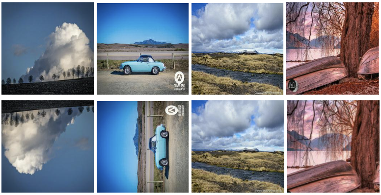
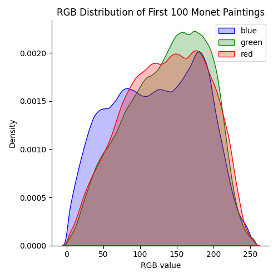
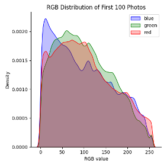
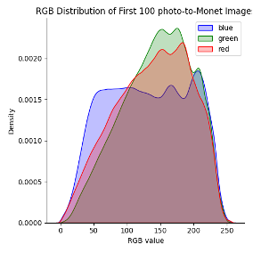
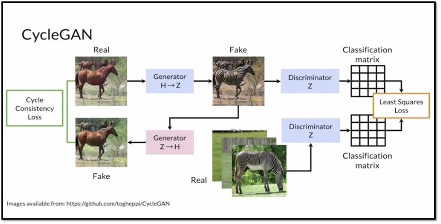

Arun Agarwal, Eric Nguyen, George Aeillo

Professor Abha Belorkar

Projects in Data Science

February 27th, 2023

# Artificially Creative - Bimonthly Progress Report I

**Introduction**:

For this Kaggle competition, we aim to implement an image style transfer model that will convert a provided photograph/image into a "Monet-style" painting.
The unique style of French painter Claude Monet, such as his color choices and brush strokes, will be imitated using Generative Adversarial Networks (GANs), which operate by training a neural network with two parts (described further below).
Our task within the scope of the competition is to build a GAN that generates 7,000 to 10,000 realistic Monet-style images.
The scope of this project extends beyond the competition, however, as we aim to allow users to upload 256x256 images to a self-created website (with a UI) that returns the image in the style of a specified artist.
While our objective is to allow for the style of multiple artists---such as Van Gogh, Cezzane, and Ukiyo-e---our initial focus will be building a successful model for one style of image-transfer (Monet), and then expanding based on that.
We also aim for the end user to receive the images relatively quickly, on the order of seconds.

**Progress**:

Overall, we have made progress in our Phase 1 demo in a variety of areas.
Here we provide a rough overview of the progress made including (1) data preparation, (2) methods, and (3) performance, which will be elaborated further in the next sections.
In terms of data preparation, we have further experimented with basic augmentation which has resulted in an increase in performance along with creating scripts to assist in exploratory data analysis.
With regard to our methods, we referenced other Kaggle notebooks and incorporated changes that seemed to improve model performance.
Then we accordingly tweaked our model's batch size, steps per epoch, and a number of other features that resulted in a significant improvement from our original best MiFID score of 51.49 to our new best score of 39.73.
To verify improvement in model performance, we ran the notebook again and achieved a score of 42.20 which indeed shows that the new model consistently performs better.
Additionally, we have implemented a script to calculate the FID metric of our model, which is a more popular metric for this task that will allow us to not only assess our performance locally but also allows us to track our model's performance on other artists in the future.
We discuss our progress in more depth in the next three sections.

**Data Preparation:**

Our data primarily consists of 256x256 RGB images of two groups: (1) Monet paintings and (2) camera photos.
Specifically, our initial dataset as provided by Kaggle includes 300 Monet paintings and 7038 photos in both JPEG and TFRecord format (TensorFlow's custom data format).
We will primarily work with the TFRecord format; however, we will have the JPEG files as a fallback should any difficulties arise when using the TFRecord format.
The total data including both formats amounts to 385.87 MB---small enough to be stored on a personal computer.

In terms of feature augmentation, we previously experimented with Differentiable Augmentation (DiffAugment)---a simple method that improves the data efficiency of GANs by imposing various types of differentiable augmentations (e.g. color, translation, and "cutout" augmentations) on both the real and generated images----but further research into this will need to be done as it did not improve the model performance in the way we expected, and we also ran into some time and memory limits when trying to implement it.
It should also be noted that the research paper that introduced the DiffAugment technique discusses that it should be used for "vanilla" GANs instead of GANs used for image style transfer.
Instead of using DiffAugment which augments the images in each training step, we have opted to augment all the images, including Monet paintings and photos, before training even begins through randomly resizing, cropping, rotating (by a multiple of 90 degrees), and flipping the images.

Figure 1: Examples of augmented images using resizing, cropping, rotation, and flipping

These augmentations appear to boost the performance of our model, as we discuss in the Performance section.
To verify that these augmentations are working as expected, we have created a script to save the augmented images as shown in Figure 1.

We have not yet done formal feature extraction; however, during Phase 2, we plan to look into other solutions on Kaggle for how they went about this.
We will then implement found feature extraction methods.
As a step toward better understanding our data, we have created a script to plot the RGB distribution of a set of images to understand the data better.
We will compare the RGB distribution amongst images as well as between photos and paintings to determine how to modify our model.
Figure 2 shows a plot of the RGB distribution for the first 100 Monet paintings, the first 100 photos, and the first 100 photo-to-Monet images (the zeros are excluded since they distort the plot)---we observe that when generating the photo-to-Monet images, the images tend toward the RGB distribution of the Monet paintings as expected.

Figure 2: RGB distribution of the first 100 Monet paintings (left), the first 100 photos (middle), and the first 100 generated photo-to-Monet images (right), with zeros excluded.

**Methods:**

As mentioned prior, we use GANs to solve this image-style transfer task.
As shown below, there is a neural network with two parts, the first of which (the discriminator) acts as a "detective" that is trained to distinguish between real and fake examples that are generated by the "generator" network.
In training, the "generator" network learns to train fake examples that are identical to the real examples, so the "detective" network is only 50% accurate.

Figure 3: Illustration of how CycleGAN works using an example of horse-to-zebra translation.

Specifically, we are using CycleGANs, a single network that uses multiple GANs to facilitate unpaired image-to-image translation.
Using the horse-to-zebra example in Figure 3, there are two generators, one generator that generates horse images and another generator that generates zebra images.
There are two discriminators, one discriminator that identifies real horse images and another discriminator that identifies real zebra images.
The key insight of CycleGANs is the use of cycle consistency loss, in which the model ensures that it is not only generating an image of any zebra or any horse, but rather a translated image of the inputted zebra or horse.
It enforces this by minimizing the difference between an original horse image and the conversion of that horse image to a zebra image and the conversion of that zebra image to a horse image.
This innovative design leads to the wide discussion of CycleGANs in the scientific literature and its encouragement by Kaggle.
Therefore, we design our solution using CycleGANs, as opposed to other models such as neural style transfer models.

We use Kaggle Notebooks to operate on the data and perform the majority of the computation required for the project.
It should be noted that due to the computational limits, we primarily referenced already existing experimental data (e.g., publicly shared Kaggle notebooks, research papers, etc.), instead of locally testing different configurations when building our model.
However, one of the tests we did perform was to train our model at varying epoch levels.
After trying out many different epochs through trial and error, we arrived at 120 epochs which produced the best score for our model.

There are two main components for training our model: the optimizers and the loss functions.
Our model used an Adam optimizer with a loss rate of 0.0002 and Beta 1 of 0.5, which were selected by default as suggested by the CycleGAN paper ([ref](https://github.com/junyanz/pytorch-CycleGAN-and-pix2pix/blob/master/options/train_options.py)).
The paper also suggests to linearly decay the loss rate to zero towards the last set of epochs, however, we ran into issues implementing this functionality and decided to omit this step from the model.

In terms of the loss functions used, we used four different loss functions: discriminator loss, generator loss, cycle loss, and identity loss.
The discriminator loss we defined as the average of the binary cross entropy loss of both the real and generated images; the generator loss we defined as the binary cross entropy loss of only the generated images; the cycle loss we defined as the average absolute difference between the real and cycled image (e.g. photo-to-Monet-to-photo), multiplied by some hyperparameter lambda (set to 10 by default), and the identity loss we defined as the average absolute difference between the real and the same image (e.g. Monet-to-Monet), also multiplied by lambda.
All the losses and their parameters were chosen according to the CycleGAN paper; we have yet to experiment much further with the loss functions.
During the training step of our model, we output four losses: the Monet generator loss, the photo generator loss, the Monet discriminator loss, and the photo discriminator loss.

In the latest iteration of our model, we added augmentations for the images before training the model. Specifically, we randomly resized, cropped, flipped, and rotated (by a multiple of 90 degrees) the images.
Furthermore, we were previously using a batch size of 1 with 300 steps per epoch, based on the number of Monet paintings existing in our data.
Now, we have adjusted this batch size to 4 and are using the max number of images in our dataset (7038 images) divided by the new batch size to get our step size of 1834.
Doing this not only boosted our performance, but it allows us to theoretically introduce more images into our model without adding to the runtime. Finally, we adjusted the generator loss function to include label smoothing, which is a regularization technique to prevent overfitting.

To train the model, it took just under 2 hours to run on TPU v3-8, leaving just 1 hour of TPU time to be available for us---most of which was used to generate and save the images to persistent storage (a total of 46.80 minutes).
Using the Kaggle-provided code for CycleGANs not only supports the strength of our baseline model, but it continues to be effective as we adjust the data and model. As will be explained in the Performance section below, CycleGANs appear to be the correct choice for this project.

**Performance:**

The success of the project will be quantified using MiFID (Memorization-informed-Fréchet Inception Distance), a modification of FID (Fréchet Inception Distance) created by Kaggle.
FID is a common metric used to assess the quality of images created by a generative model, such as a GAN.
Unlike the Inception Score (IS)--another common metric for GAN evaluation described later--the FID compares the distribution of generated images with the distribution of a set of real/ground truth images.
Specifically, FID computes the Fréchet distance between two Gaussian distributions fitted to feature representations of the Inception network.
Here, one uses the Inception network to extract features from an intermediate layer.
From there, one models the data distribution for these features using a multivariate Gaussian distribution with mean 𝜇 and covariance Σ.
As provided by Kaggle, the FID between the real images *r* and the generated images *g* is computed as

where *Tr* is the sum of the diagonal elements.

On top of FID, this Kaggle competition takes into account training sample memorization in the performance metric.
First, the memorization distance is calculated as the minimum cosine distance of the training samples in the feature space, averaged across all user-generated image samples.
This distance is assigned a value of 1 if the distance exceeds a pre-defined epsilon.
MiFID is then the FID metric multiplied by the inverse of the memorization distance (with the implemented threshold).

Kaggle calculates public MiFID scores with the pre-trained neural network Inception, and the public images used for evaluation are the rest of the TFDS Monet Paintings.
The competition calculates the MiFID score after we submit our code/solution on Kaggle, so we cannot recreate the calculations for our personal use (mostly due to the memorization distance).
That is, this competition keeps our performance hidden from us until after submission, which becomes problematic as the code takes 2+ hours to run.
Therefore, we decided to look into how to calculate FID ourselves and wrote corresponding functions in our scripts to do so.
FID is also a common scoring metric for GANs, so we can use this formulation to compare our models and scores with previous/related work.
This then helps us understand how to boost our performance.

While FID is the most common metric used by others in the domain, Inception Score is also popular.
This score takes a list of images and returns a single floating-point number, which is a score of how realistic the GAN's output is.
The score measures the variety of the images as well as their distinct quality (each image looks like an actual distinct entity).
The Inception Score is high when both of these quality scores are high.
Unfortunately, IS does not capture how synthetic images compare to real images; that is, IS will only evaluate the distribution of the generated images.
Therefore, FID was developed to evaluate synthetic images based on a comparison of the synthetic images to the real images from the target domain.
While it is true that FID commonly produces high bias, this is no less true for Inception Score.
This and the fact that Inception Score is limited by what the Inception (or other network) classifier can detect, FID is more popularly used to score GANs today and is what we use for our project.

Regarding our performance before the Phase 1 Demo, the line graph below (Figure 4) demonstrates our score improvement.

Figure 4: Chart of our Phase 1 Demo model's MiFID score trained at
different epochs.

We began with running the CycleGAN for 2 epochs and received a MiFID score of 89.93474, placing us towards the bottom of the leaderboard.
From there, we tried 60 and 100 epochs, getting scores of 62.69862 and 51.78384, respectively.
Noticing that an increase in epochs correlated with a decrease in MiFID value (increase in score), we decided to run our code for 150 epochs and got a score of 55.55696.
This slight increase made it clear that the optimal MiFID score would exist between 100 and 150 epochs, so we did one last run at 120 epochs before the demo presentation.
This led to a MIFID score of 51.49337, placing us 49/94 on the leaderboard.
With the best scores being in the mid-30s, we realized we would need to try other things to push our score up.

The data preparation and label smoothing steps described in the model section led to our new highest MiFID score of 39.73202, placing us 25/98 on the leaderboard.
This score varies slightly due to the random nature of model parameter initialization.
One result is displayed below, along with a result from another top-performing competitor.

Figure 5: A photo (left), our generated Monet-style painting of the photo (middle), and a generated Monet-style painting of the photo by a top-performing competitor.

In Figure 5 above, we notice that both resulting paintings seem like good takes on the Monet version of the image, just slightly different in their outcome.
Our sky appears to have more color and blur in some areas, while the other team's sky is more desaturated and plain.
Their ground also appears to be finer (less blurry) than ours.

**Plan**:

For the next two weeks, we have a variety of planned tasks.
First, we plan to look at other notebooks provided on the Kaggle competition that perform EDA steps to figure out what we can do here for our project.
After performing these EDA steps and creating a few plots, we hope that we realize new ways to adjust our model and improve our MiFID score.
We are already working on this slightly by trying to understand the RGB distribution of our provided photos and paintings, as well as the generated paintings.
We have already written a function to split the image into its three color distributions (plots shown in Figure 2).
Another plan we have is to refactor our code on GitHub as we have currently made a lot of adjustments to our model.
We expect to be done with these changes in approximately a week.
On top of this, we also plan on experimenting with another form of Generative Network regularization, known as the LeCam Loss.
While we have not found literature or research indicating its use with CycleGAN or image-to-image translation, it has quantitatively improved the performance of GANs that try to generate images with a limited dataset.
Currently, we have been able to locate the author's code that implements this loss function, so we plan to implement it in our model within the next two weeks.
Moving on, we plan on adding additional Monet data to our model to potentially increase our score, as GANs usually perform better with more data.
This process is something we recently realized the top solutions on the leaderboard have done, and we would have done the same earlier if we knew of this.
We were under the assumption that the only data available was provided to us in the 'Data' section on Kaggle, but we will now integrate this extra data into our model.
Once we have developed a strong understanding of the modeling process via CycleGAN, we may consider applying that knowledge to train other models, such as UVCGAN.
We would then compare the results between the models, hoping for a score improvement.
However, our team will have to weigh the advantages/disadvantages of using these other models.
For instance, most state-of-the-art models have had training times up to 60 hours on other datasets and Kaggle has restricted the code results to take less than 5 hours if running on a GPU or CPU and less than 3 hours if the code is running on a TPU.
UVCGANs are among these models for which we will encounter runtime dilemmas.
Our team will likely not use the state-of-the-art style transfer models due to these time constraints.
Nonetheless, we plan to look into other models in the next two weeks to not miss out on any score improvement opportunity.

For the long term, once we finalize our model, we will deploy it as a service for end users to access via an online web interface.
Our website will be powered by Google Cloud Platform (GCP), where the model and user-uploaded images will be stored via GCP Cloud Storage and a GCP Cloud Function will perform the necessary business logic to retrieve user input and deliver model output via HTTP requests.
For the web interface itself, we will use Next.js, a web application framework, since it is what we are familiar with.
For the scope of this project, the only functionality we are providing to the end user is a single stylized version of their uploaded input image as generated by our model.
Given time, we may consider adding features including batch processing of multiple input images, generating multiple stylized versions of an input image, etc.

**Remaining Questions:**

There are three main areas of the project that require further exploration.
As mentioned in the previous section, the first of these involves our Monet model itself and finalizing our decisions regarding this model.
One portion of this will be understanding what type of EDA steps we should be performing and how we can have the results of this influence our model decisions.
This also involves determining whether a different model than a CycleGAN can/should be implemented in our final solution.
This is especially important, as the decisions we make in this model will likely be used in our style transfer of other artists, as we do not have the computational resources available to stimulate a large variety of hyperparameter, augmentation, and architecture settings for each artist that we plan on having available on our website.
Our second area of the project that requires further exploration is finalizing the artists that will be used in our website.
We plan on primarily making these decisions based on the amount of time that we have before our Phase 2 demo, our computational resources, and the artists that have datasets provided by the CycleGAN paper authors.
The last portion of our project that requires exploration involves the interactive website that we plan to build.
We will need to determine the back-end design and how to properly format the front-end for the user.
Also, we will need to decide whether to use pre-trained models, our own models, or allow the user to pick and choose between both options on this application.

**Expected Results:**

At the end of the next two weeks, we anticipate that our Image-to-Monet model will be completed in terms of the overall architecture, hyperparameters, and other design decisions (example: the amount of data we use).
While we will not be able to test every permutation of these hyperparameters and design decisions due to time and computational constraints, we believe that we can achieve an MiFID score in the mid-30s (improving our score from \~39 to \~35), placing us at the top of the leaderboard.
In the case that our models take over 3 hours on a TPU to run, or take over 5 hours on a GPU, we would use FID to evaluate the performance of our model, rather than MiFID.
If we reach this milestone before the end of the next two weeks of class, we plan to finalize our decision about the other artists that should be used in this project.
This also will mean extending, or slightly tweaking, our "Monet" model to these other artists.

**References:**

-   [Label Smoothing --- Make your model less (over)confident \| by Parthvi Shah \| Towards Data Science](https://towardsdatascience.com/label-smoothing-make-your-model-less-over-confident-b12ea6f81a9a)

-   [GAN Structure](https://developers.google.com/machine-learning/gan/gan_structure)

-   [I'm Something of a Painter Myself \| Kaggle](https://www.kaggle.com/competitions/gan-getting-started)

-   [CycleGAN: a GAN architecture for learning unpaired image to image transformations (haikutechcenter.com)](https://www.haikutechcenter.com/2020/11/cyclegan-gan-architecture-for-learning.html)

-   [FID Explained](https://en.wikipedia.org/wiki/Fr%C3%A9chet_inception_distance)

-   [Inception Score Explained](https://medium.com/octavian-ai/a-simple-explanation-of-the-inception-score-372dff6a8c7a)

-   [CycleGANWithPretrainModules \| Kaggle](https://www.kaggle.com/code/ashutoshardu/cycleganwithpretrainmodules)

-   [Monet CycleGAN Tutorial 489942 \| Kaggle](https://www.kaggle.com/code/nguyene/monet-cyclegan-tutorial-489942)

-   [Differentiable Augmentation for Data-Efficient GAN Training](https://arxiv.org/abs/2006.10738v4)

-   [github.com/junyanz/pytorch-CycleGAN-and-pix2pix](https://github.com/junyanz/pytorch-CycleGAN-and-pix2pix/blob/master/options/train_options.py)
