Arun Agarwal, Eric Nguyen, George Aeillo

Professor Abha Belorkar

Projects in Data Science

April 3rd, 2023

# Artificially Creative - Bimonthly Progress Report II

**Introduction**:

For this Kaggle competition, we aim to implement an image style transfer model that will convert a provided photograph/image into a "Monet-style" painting (Kaggle Competition).
The unique style of French painter Claude Monet, such as his color choices and brush strokes, will be imitated using Generative Adversarial Networks (GANs), which operate by training a neural network with two parts (described further in Methods).
Our task within the scope of the competition is to build a GAN that generates 7,000 to 10,000 realistic Monet-style images of dimensions 256 X 256 X 3 (RGB) (Kaggle Competition).
The scope of our project extends beyond the competition, however, as we aim to allow users to upload images to a website (with a UI) that returns the image in the style of a specified artist, including Van Gogh, Cezzane, and Ukiyo-e.
While our objective is to allow for the style of multiple artists, our initial focus will be building a successful model for one style of image-transfer (Monet), and then expanding based on that.
We plan to improve the accuracy of these style transfer models once a baseline is built.
Due to the bidirectional nature of CycleGANs, we also aim to integrate artist-to-artist style transfers.
The models should be able to take the user\'s input image and produce a downloadable stylized version of the input image relatively quickly, on the order of seconds.

**Progress**:

Overall, we have made progress since our Phase I demo in a variety of areas.
Here we provide a rough overview of the progress made including (1) data preparation, (2) methods, (3) performance, and (4) website, which will be elaborated further in the next sections.
In terms of data preparation, we have further experimented with basic augmentation, which has resulted in an increase in performance along with creating scripts to assist in exploratory data analysis.
Concerning our methods, we referenced other Kaggle notebooks and incorporated changes that seemed to improve model performance.
Then, we accordingly tweaked our model's batch size, steps per epoch, and several other features that resulted in a significant improvement from our original best baseline model's MiFID score of 51.49 to our new best score of 39.73.
To verify improvement in model performance, we ran the notebook again and achieved a score of 42.20 which indeed shows that the new model consistently performs better.
Additionally, we have implemented a script to calculate the FID metric of our model, which is a more popular metric for this task that will allow us to not only assess our performance locally but also allows us to track our model's performance on other artists in the future.
Furthermore, we have completed our objective of allowing for the style transfer of multiple artists by expanding upon our image transfer model for Monet.
Finally, we have developed the skeleton for our website, allowing for users to receive paintings from inputted photos in the order of seconds.
We discuss our progress in more depth in the next three sections.

_Data Preparation:_

Our competition data primarily consists of 256x256 RGB images of two groups: (1) Monet paintings and (2) camera photos.
Specifically, our initial dataset as provided by Kaggle includes 300 Monet paintings and 7038 photos in both JPEG and TFRecord format (TensorFlow's custom data format).
We will primarily work with the TFRecord format; however, we will have the JPEG files as a fallback should any difficulties arise when using the TFRecord format.
The total competition data including both formats amounts to 385.87 MB---small enough to be stored on a personal computer.
Our group also utilizes image data for additional paintings provided by the authors for not only Monet but Van Gogh, Ukiyo-e, and Cezanne as well.

While the data size is relatively small, the problem requires intense computation within a limited timeframe, so we make the data accessible by TPU-equipped machines for the best results.
Kaggle conveniently provides access to the initial dataset stored in their systems through their Kaggle Notebooks (Jupyter Notebook service provided by Kaggle) which provide free limited access to TPU computers.
Indeed, we use Kaggle Notebooks to operate on the data and perform the majority of the computation required for the project.
So far in the project, we have not run into rate limitation issues on Kaggle, but we have run into a variety of problems involving the use of the Temple HPC node, such as the other users hogging the GPUs on the node, along with issues finding access to any useable GPU on the Node.
Due to the relative reliance on Kaggle compared with the Temple HPC node, we anticipate working on Kaggle for the remainder of the project.

We have opted to augment all the images involved in the training process for both our competition and our generic models through randomly resizing, cropping, rotating (by a multiple of 90 degrees), and flipping the images before training even begins.

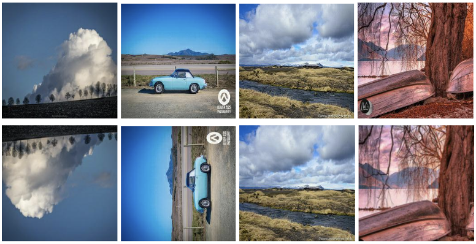

Figure 1: Examples of augmented images using resizing, cropping, rotation, and flipping

(self-generated)

These augmentations boost the performance of our model, as we discuss in the Performance section.
To verify that these augmentations are working as expected, we have created a script to save the augmented images, as shown in Figure 1.

For those models trained using the author's respective training data (paintings and photos) for each artist, we needed to gather and convert these JPG images into TFREC format to be usable in our pipeline.
This required writing multiple scripts to implement the process.
In addition, we developed a standardized train/test split based on the CycleGAN's authors\' data.
Thus, we generated the testing data for these models by augmenting 10% of the existing training data for an artist through flips and rotations.
We do not crop the images in these new augmentations in an attempt to reduce pixelation.
This data was then added to the existing test dataset for that artist, allowing us to expand the test data size while also introducing variation.

As a step toward better understanding our data, we have created a script to plot the RGB distribution of a set of images to understand the data better.
We compare the RGB distribution amongst images as well as between photos and paintings to determine how to modify our model.
Figure 2 shows a plot of the RGB distribution for the first 100 Monet paintings, the first 100 photos, and the first 100 photo-to-Monet images (the zeros are excluded since they distort the plot)---we observe that when generating the photo-to-Monet images, the images tend toward the RGB distribution of the Monet paintings as expected.
Therefore, these distributions serve as a small sanity check that our model is transferring the color/style well.
The RGB distribution of individual images can be examined on our website, as described later.

[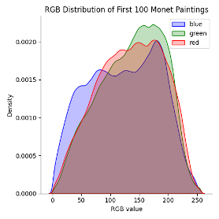](Images/monet_rgb_distribution.png)
[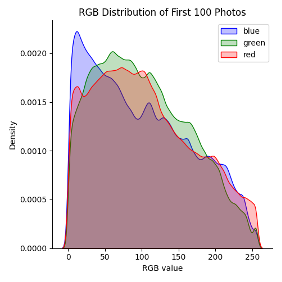](Images/photo_rgb_distribution.png)

Figure 2: RGB distribution of the first 100 Monet paintings (left), the first 100 photos (middle), and the first 100 generated photo-to-Monet images (right), with zeros excluded.

_Methods:_

As mentioned prior, we use GANs to solve this image-style transfer task.
As shown in the diagram below, the first component of the network acts as a "detective" that is trained to distinguish between real examples and fake examples that are generated by the second "generator" component.
In training, the "generator" component learns to train fake examples that are identical to the real examples, so the "detective" component is only 50% accurate (1).

Figure 3: Diagram of GAN Process (1)

Specifically, we are using CycleGANs, a single network that uses multiple GANs to facilitate unpaired image-to-image translation.
Using the horse-to-zebra example in Figure 4, there are two generators, one generator that generates horse images and another generator that generates zebra images.
There are two discriminators, one discriminator that identifies real horse images and another discriminator that identifies real zebra images.
Similar to GANs, there is discriminator loss and generator loss.
However, the key insight of CycleGANs is the use of cycle consistency loss, in which the model ensures that the image is the same after being pushed back into different generators (11).
With regard to the Figure 4 example, it is not only generating an image of any zebra or horse but rather a translated image of the inputted zebra or horse.
It enforces this by minimizing the difference between an original horse image and the conversion of that horse image to a zebra image and the conversion of that zebra image to a horse image (11).
This innovative design leads to the wide discussion of CycleGANs in the scientific literature and its encouragement by Kaggle.
Therefore, we design our solution using CycleGANs, as opposed to other models such as neural style transfer models.
While we did look into other state-of-the-art models, the large training times, the amount of data used, and the large quantity of time required to understand other parts of deep learning, such as vision transformers, would have required our group to conduct in-depth-research and retool our project from scratch, rather than a simple swap of models (4).

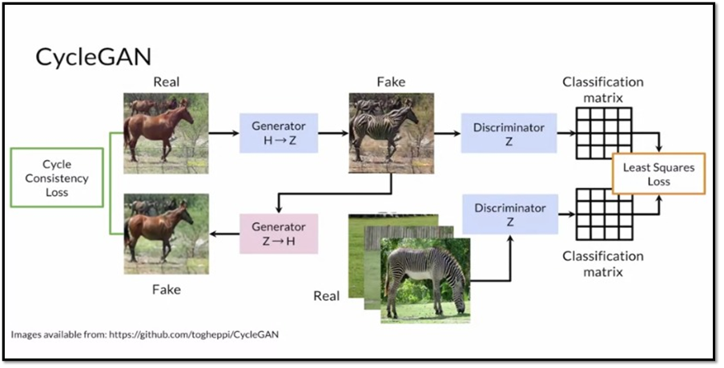

Figure 4: Illustration of how CycleGAN works using an example of horse-to-zebra translation (2)

We use Kaggle Notebooks to operate on the data and perform the majority of the computation required for the project.
It should be noted that due to the computational limits, we primarily referenced already existing experimental data (e.g., publicly shared Kaggle notebooks, research papers, etc.), instead of locally testing different configurations when building our model.
However, one of the tests we did perform was to train our model at varying epoch levels.
After trying out many different epochs through trial and error, we arrived at 120 epochs, which produced the best score for our Demo 1 model.

There are two main components for training our model: the optimizers and the loss functions.
Our initial model used an Adam optimizer with a loss rate of 0.0002 and Beta 1 of 0.5, which were selected by default as suggested by the CycleGAN paper (10).
The paper also suggests that we should linearly decay the loss rate to zero towards the last set of epochs, however, we ran into issues implementing this functionality and decided to omit this step from the model.

In terms of the loss functions used, we used four different loss functions: discriminator loss, generator loss, cycle loss, and identity loss.
The discriminator loss we defined as the average of the binary cross entropy loss of both the real and generated images; the generator loss we defined as the binary cross entropy loss of only the generated images; the cycle loss we defined as the average absolute difference between the real and cycled image (e.g. photo-to-Monet-to-photo), multiplied by some hyperparameter lambda (set to 10 by default), and the identity loss we defined as the average absolute difference between the real and the same image (e.g. Monet-to-Monet), also multiplied by lambda.
All the losses and their parameters were chosen according to the CycleGAN paper; we experiment with the loss functions in later models.
During the training step of our model, we output four losses: the Monet generator loss, the photo generator loss, the Monet discriminator loss, and the photo discriminator loss.

In the latest iteration of our competition model, we trained for 30 epochs (justification seen in Performance section) and added augmentations for the images before training the model.
Specifically, we randomly resized, cropped, flipped, and rotated (by a multiple of 90 degrees) the images, as mentioned earlier.
Furthermore, we were previously using a batch size of 1 with 300 steps per epoch, based on the number of Monet paintings existing in our data.
Now, we have adjusted this batch size to 4 and are using the max number of images in our dataset (7038 images) divided by the new batch size to get our step size of 1834.
Doing this not only boosted our performance, but it allows us to theoretically introduce more images into our model without adding to the runtime.
Finally, we adjusted the generator loss function to include label smoothing, which is a regularization technique to prevent overfitting (7).
It should be noted that the same model was used for the Cezanne, Ukiyo-e, and Van-Gogh generators as well, just with the artist data replaced accordingly.
This would then generate different weights for the artists, which get fed into our website.

To train the model, it took just under 2 hours to run on TPU v3-8, leaving just 1 hour of TPU time to be available for us---most of which was used to generate and save the images to persistent storage (a total of 46.80 minutes).
Using the Kaggle-provided code for CycleGANs not only supports the strength of our baseline model, but it continues to be effective as we adjust the data and model.
As will be explained in the Performance section below, CycleGANs appear to have been the correct choice for this project.

_Performance:_

The success of the project will be quantified using MiFID (Memorization informed Fréchet Inception Distance), a modification of FID (Fréchet Inception Distance) created by Kaggle.
FID is a common metric used to assess the quality of images created by a generative model, such as a GAN.
Unlike the Inception Score (IS)--another common metric for GAN evaluation described later--the FID compares the distribution of generated images with the distribution of a set of real/ground truth images.
Specifically, FID computes the Fréchet distance between two Gaussian distributions fitted to feature representations of the Inception network (9).
Here, one uses the Inception network to extract features from an intermediate layer.
From there, one models the data distribution for these features using a multivariate Gaussian distribution with mean 𝜇 and covariance Σ.
As provided by Kaggle, the FID between the real images _r_ and the generated images _g_ is computed as

\(3\)

where _Tr_ is the sum of the diagonal elements.

On top of FID, this Kaggle competition takes into account training sample memorization in the performance metric.
First, the memorization distance is calculated as the minimum cosine distance of the training samples in the feature space, averaged across all user-generated image samples (3).
This distance is assigned a value of 1 if the distance exceeds a pre-defined epsilon.
MiFID is then the FID metric multiplied by the inverse of the memorization distance (with the implemented threshold).

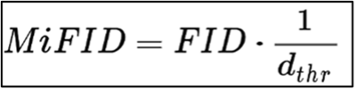

\(3\)

Kaggle calculates public MiFID scores with the pre-trained neural network Inception, and the public images used for evaluation are the rest of the TFDS Monet Paintings.
The competition calculates the MiFID score after we submit our code/solution on Kaggle, so we cannot recreate the calculations for our personal use (mostly due to the memorization distance).
That is, this competition keeps our performance hidden from us until after submission, which becomes problematic as the code takes 2+ hours to run.
We would also need a method to measure our performance to complete the proposed steps that extend beyond the scope of the competition.
Therefore, we looked into how to calculate FID ourselves, and wrote corresponding functions in our scripts to do so.
FID is also a common scoring metric for GANs, so we can use this formulation to compare our models and scores with previous/related work.
This then will help us understand how to boost our performance.

While FID is the most common metric used by others in the domain, Inception Score is also popular.
This score takes a list of images and returns a single floating-point number, which is a score of how realistic the GAN's output is (5).
The score measures the variety of the images as well as their distinct quality (each image looks like an actual distinct entity).
The Inception Score is high when both of these quality scores are high.
Unfortunately, IS does not capture how synthetic images compare to real images; that is, IS will only evaluate the distribution of the generated images.
Therefore, FID was developed to evaluate synthetic images based on a comparison of the synthetic images to the real images from the target domain (5).
While it is true that FID commonly produces high bias, this is no less true for Inception Score.
This and the fact that Inception Score is limited by what the Inception (or other networks) classifier can detect, FID is more popularly used to score GANs today and is what we will use for our project.

Regarding our performance for Demos 1 and 2, the line graph below (Figure 5) demonstrates our score improvement.

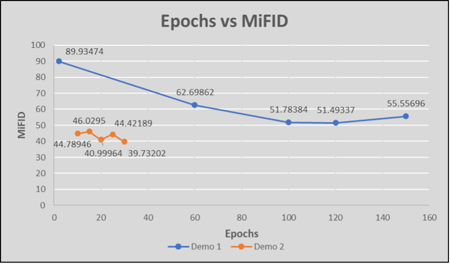

Figure 5: Chart of our Phase 1 and 2 Demo models' MiFID scores trained at different epochs

We began with running the CycleGAN for 2 epochs and received a MiFID score of 89.93474, placing us toward the bottom of the leaderboard.
From there, we tried 60 and 100 epochs, getting scores of 62.69862 and 51.78384, respectively.
Noticing that an increase in epochs correlated with a decrease in MiFID value (increase in score), we decided to run our code for 150 epochs and got a score of 55.55696.
This slight increase made it clear that the optimal MiFID score would exist between 100 and 150 epochs, so we did one last run at 120 epochs before the Demo 1 presentation.
This led to a MiFID score of 51.49337, placing us 49/94 (\~52nd percentile) on the leaderboard.
With the best scores being in the mid-30s, we realized we would need to try other things to push our score up.

The data preparation and label smoothing steps described in the model section led to our new highest MiFID score of 39.73202, placing us 17/143 (\~12th percentile) on the leaderboard.
As shown by the Demo 2 line (orange), we tried our model at 10, 15, 20, 25, and 30 epochs, with 30 epochs displaying the best MiFID.
This score varies slightly due to the random nature of model parameter initialization.

As mentioned prior, we needed to use FID to measure our performance for the other artists, which are neatly summarized in the line graph below.

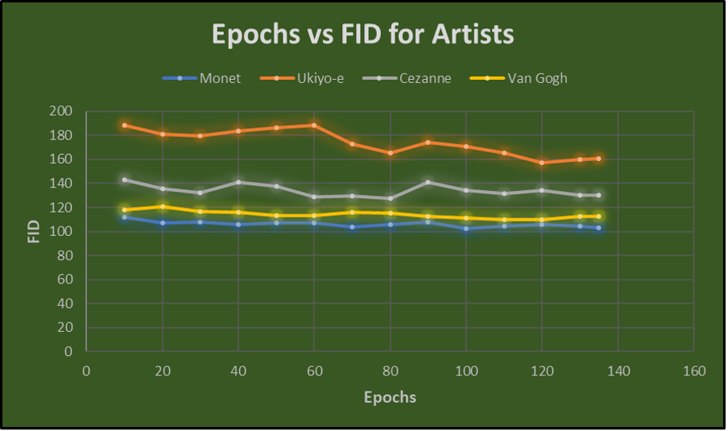

Figure 6: Chart of our FID scores trained at different epochs for Monet, Ukiyo-e, Cezanne, and Van Gogh

For these artists, epoch levels of 10, 20, 30, 40, 50, 60, 70, 80, 90, 100, 110, 120, 130, and 135 were tested.
For Monet, the optimal FID score is 102.741400871309 at 100 epochs.
For Ukiyo-e, the optimal FID score is 157.03577685953 at 120 epochs.
For Cezanne, the optimal FID score is 127.26456665873 at 80 epochs.
Finally, for Van Gogh, the optimal FID score is 109.882316820886 at 120 epochs.

Our performance should not only be measured by our MiFID and FID scores but also by examining the outputted images.
One result is displayed below, along with the result from using the author's model weights (10).

[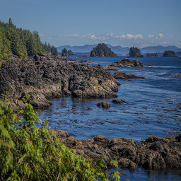](Images/good_example_photo.jpg)
[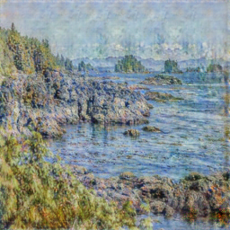](Images/good_example_ours.jpg)
[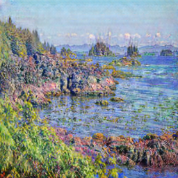](Images/good_example_authors.jpg)

Figure 7: A photo (left), our generated Monet-style painting of the photo (middle), and a generated Monet-style painting of the photo using the author's model weights (10).

In Figure 7 above, we notice that both resulting paintings seem like good takes on the Monet version of the image, just slightly different in their outcome.
Our sky appears to have more blur in some areas, while the author's sky is more saturated and plain.
The author's buildings also have deeper color shades than ours, but both seem to look like Monet-ified versions of the original image.
Figure 8 below demonstrates a bad example output.

[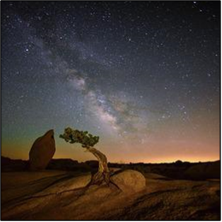](Images/bad_example_photo.png)
[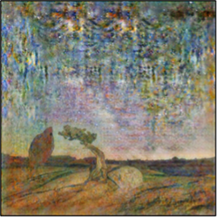](Images/bad_example_ours.png)
[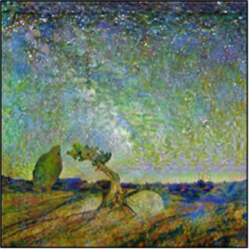](Images/bad_example_authors.png)

Figure 8: A photo (left), our generated Monet-style painting of the photo (middle), and a generated Monet-style painting of the photo using the author's model weights (10).

As this example helps to demonstrate, our model does not always do well on darker images, as it ended up blurring the sky and omitting the stars; in contrast, the author's output captured the essence of the stars in the sky without blurring anything.
The colors are again deeper shades in the author's output compared to ours.
Overall, we ended up noticing that our model does just as well with nature and sprawling images (e.g., skies, meadows, oceans) as the author's model.
However, the model does poorly sometimes when the photos are detailed or contain non-natural things such as buildings and people.

_Website:_

We have developed and deployed a working web application that runs our models for free and for anyone to use on the internet. Our web application is entirely client-side, using the ONNX (Open Neural Network Exchange) (6) and TensorFlow.js (8) runtimes to enable model inferencing locally on the client's browser.
To store our models on the web, we convert the author's PyTorch models from PTH format to ONNX format and our TensorFlow models to TensorFlow.js format (a combination of BIN and JSON files) and store them in our GitHub repository in a separate "vercel" branch apart from the "master" branch to prevent large binaries in our commit history.
Our website is powered by Vercel, a cloud platform that has built-in integration with GitHub and automatically detects and deploys all changes made to our GitHub repository.
It also provides web analytics, such as the number of visitors and user experience metrics.
For the user interface, we use Next.js, a web application framework, since it is what we are familiar with and has proven to be easy to work with.
Currently, our web application allows the user to upload a JPG or PNG image of any size, from which our application resizes the width and height of the user-uploaded image to 256x256 and then generates a stylized version of the user-uploaded image as a downloadable JPG.
The website also allows one to examine the RGB distribution of an inputted image before and after transformation.

**Plan:**

For the remaining portion of Phase III, we will mainly be working on two distinct areas of our project.

_Documentation:_

As seen in the course syllabus, Phase III consists of three major assignments.
The first assignment is our Data Report, in which we will describe the data that was used for our models, such as how the data was gathered and preprocessed.
While we have most of the information regarding our data scattered throughout our various documents written during the semester, it will take time and effort to synthesize this knowledge in a 5-8 page paper.
Due to this, we plan on spending the majority of our time in the first week of Phase III working on the Data Report.

Similarly, the second major writing component of Phase III is the Model and Performance Report.
In this report, we will go into extensive detail regarding the models that we have developed, such as by describing the metrics used to evaluate these various models.
Similar to the Data Report, we have all the information needed to generate this document, but it will take time to retrieve this information and format it efficiently in a 6-10 page paper.
Thus, we plan on spending the vast majority of the second week of Phase III working on the Model and Performance Report.

Finally, the last major assignment of Phase III is our final demo, in which we will present not only our final website to an audience but also a presentation explaining all the progress that we have made throughout the semester.
In these last two weeks, we plan on putting any required finishing touches on the website, along with creating, revising, and rehearsing our final presentation.
We plan on spending the bulk of our time on these tasks during the final weeks of Phase III.

_Website:_

While we have the core functionality implemented on the website, there are several more ideas we have in mind in terms of new features for the website.
We plan to implement painting-to-painting generators on the website, which will allow the user to upload an image of a painting in one style and convert it into a painting of another style.
This concept is best illustrated by an example.
For a Monet-to-Cezanne style transfer, a Monet painting will be converted into a photo by using an existing Monet-to-photo model, then this photo will be converted into a Cezanne painting by a photo-to-Cezanne generator.
Additionally, we also plan to update the models on our website to use the models that had the lowest FID.
Aside from new features, we plan on updating the website aesthetically by experimenting with different possible styling choices such as different layouts, backgrounds, and animations.

**Remaining Questions:**

There are two main areas of the project that require further exploration.
As mentioned in the previous section, the main area of the project that we will be working on is our interactive website.
While we have a broad idea of what our website will look like, we have some questions regarding some minor implementation details, such as the design of initial webpages and the potential for additional functions for users.

On top of this, we will also be exploring the use of artist-to-artist/painting-to-painting style transfers for various artists.
White we know in theory how this should work, but there are still implementation details that are unknown, such as how it will be loaded into our website and how this process will take place on the back end.

**Expected Results:**

By the end of Phase III, we hope to have expanded our website to include a variety of models regarding Monet, Cezanne, Van Gogh, and Ukiyo-e paintings.
Specifically, we plan on having all the author's models available on our website, as the author has photo-to-painting models for all artists and a Monet-to-photo model.
We will also have all our implementations of photo-to-painting and painting-to-photo for all artists.

On top of this, we will include the possibility for users to do style transfers from artist to artist. In total, we plan on having 12 artist-to-artist style transfers, to represent each possible transfer from one artist to another artist. While we are not expecting good results from these artist-to-artist transfers, as our artist-to-photo results will not be as good as our photo-to-artist results, we view it as an interesting exercise in exploring potential future uses of CycleGANs.

Finally, we will spend time during this phase documenting and summarizing our progress made throughout the semester.
We expect to have a completed Data Report along with a finished Model and Performance Report by the end of Phase III along with a final demo that will demonstrate our progress throughout the semester.

**References**:

1.  Google Developers. (2022, July 18). _Overview of GAN Structure_. Google. Retrieved April 3, 2023, from https://developers.google.com/machine-learning/gan/gan_structure

2.  Haiku Tech Center. (2020, November 1). \*CycleGAN: A GAN architecture for learning unpaired image to image transformations\*. Haiku Tech Center. Retrieved April 3, 2023, from https://www.haikutechcenter.com/2020/11/cyclegan-gan-architecture-for-learning.html

3.  Jang, A., Uzsoy, A. S., & Culliton, P. (2020). _I\'m Something of a Painter Myself_. Kaggle. Retrieved April 3, 2023, from https://www.kaggle.com/competitions/gan-getting-started

4.  LS4GAN Group. (2022, August 9). _LS4GAN/Benchmarking_. GitHub. Retrieved April 3, 2023, from https://github.com/LS4GAN/benchmarking

5.  Mack, D. (2019, March 7). _A simple explanation of the Inception Score_. Medium. Retrieved April 3, 2023, from https://medium.com/octavian-ai/a-simple-explanation-of-the-inception-score-372dff6a8c7a

6.  ONNX. (2019). _Open Neural Network Exchange_. ONNX. Retrieved April 3, 2023, from https://onnx.ai/

7.  Shah, P. (2021, June 3). _Label Smoothing - Make your model less (over)confident_. Medium. Retrieved April 3, 2023, from https://towardsdatascience.com/label-smoothing-make-your-model-less-over-confident-b12ea6f81a9a

8.  TensorFlow. (2023). _TensorFlow.js: Machine learning for JavaScript developers_. TensorFlow. Retrieved April 3, 2023, from https://www.tensorflow.org/js

9.  Wikipedia. (2023, March 25). _Fréchet inception distance_. Wikipedia. Retrieved April 3, 2023, from [https://en.wikipedia.org/wiki/Fr%c3%a9chet_inception_distance](https://en.wikipedia.org/wiki/Fr%c3%a9chet_inception_distance)

10. Zhu, J.-Y. (2023, March). _Junyanz/Pytorch-Cyclegan-and-pix2pix: Image-to-image translation in pytorch_. GitHub. Retrieved April 3, 2023, from https://github.com/junyanz/pytorch-CycleGAN-and-pix2pix

11. Zhu, J.-Y., Park, T., Isola, P., & Efros, A. A. (2020, August 24). _Unpaired Image-To-Image Translation using Cycle-Consistent Adversarial Networks_. arXiv.org. Retrieved April 3, 2023, from https://arxiv.org/abs/1703.10593
