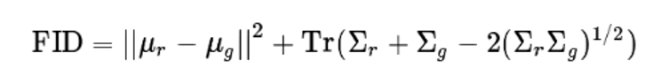
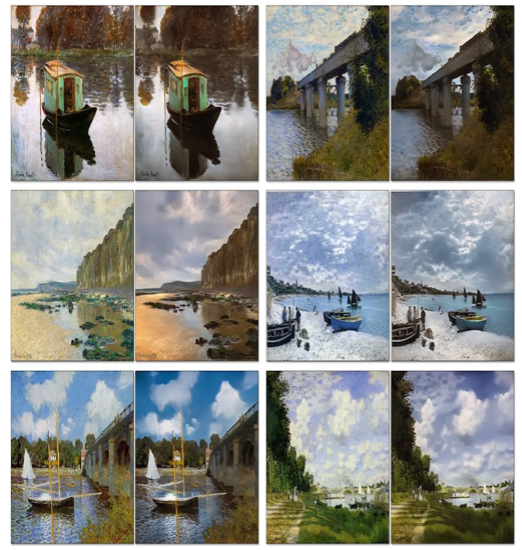
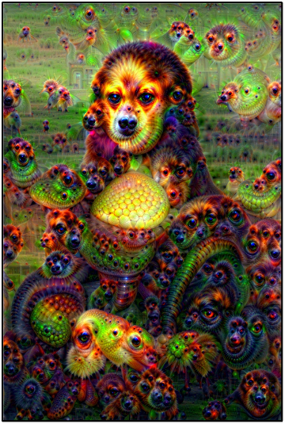

Arun Agarwal, Eric Nguyen, George Aeillo

Professor Abha Belorkar

CIS 4496 - Projects in Data Science

February 4th, 2023

Project Charter

1.  **Problem Description**:

Have you ever thought to yourself, after taking a picture of a beautiful scenery, what would it look like if a famous painter was there and made a painting of it?
We aim to solve this data science issue of style transfer, in which a user-generated image will be transferred to a "Monet-style" painting.
The unique style of Claude Monet, such as his color choices and brush strokes, can now be imitated thanks to algorithms called Generative Adversarial Networks (GANs), which operate by training two neural networks.
As shown in the diagram below, one neural network acts as a "detective" that is trained to distinguish between real examples and fake examples that are generated by the "generator" network.
In training, the "generator" network learns to train fake examples that are identical to the real examples, so the "detective" network is only 50% accurate.
Our task is to build a GAN that generates 7,000 to 10,000 realistic Monet-style images.

[https://developers.google.com/machine-learning/gan/gan_structure](https://developers.google.com/machine-learning/gan/gan_structure)

While GANs were initially developed for organic image generation, they have also been revolutionary in many other tasks relating to images, such as style-transfer between images.
Specifically, one type of GAN technique that has become prominent in style-transfer is a specific type of GAN network known as CycleGANs.
We could potentially expand to other artists, but this is a later role in our project that will be decided at that time.

This problem is important for a variety of reasons.
For example, this is a significant area of public interest, as AI-generated art is rapidly becoming a prominent industry with a significant amount of public interest, as evidenced by recent art auctions where AI-generated art has
sold for hundreds of thousands of dollars.
On top of this, this could be a fun and interactive experience for our users, as they could personalize our projects. Furthermore, due to the bidirectional nature of CycleGANs, users could potentially upload Monet-images and this image would be transferred in the style of a photograph.
If time permits, these image-to-photo and photo-to-image style transfers could be combined, which would allow artist to artist style transfers.

2.  **Project Scope**:

The end user will be able to upload an image and download a stylized version of the image.
For the scope of this project, we are restricting the user's input image size to 256x256 images, and we are focusing on emulating French painter Claude Monet's style of art when generating the stylized images.
Additionally, we are aiming for the end user to receive their images relatively quickly, on the order of seconds.
Building on the previous section, the scope of the project could potentially expand to encompass image style-transfers to other artists.
However, the scope of our project will initially be working on a successful mode for one style of image-transfer, and then expanding based on that.

3.  **Metrics**:

The success of the project will be quantified using MiFID (Memorization-informed-Fréchet Inception Distance), a modification of
FID (Fréchet Inception Distance) created by Kaggle.
FID is a common metric used to assess the quality of images created by a generative model, such as a GAN.
Unlike the Inception Score (IS)&mdash;another common metric for GAN evaluation&mdash;the FID compares the distribution of generated images with the distribution of a set of real/ground truth images.
Specifically, FID computes the Fréchet distance between two Gaussian distributions fitted to feature representations of the Inception network.
Here, one uses the Inception network to extract features from an intermediate layer.
From there, one models the data distribution for these features using a multivariate Gaussian distribution with mean 𝜇 and covariance Σ. As provided by Kaggle, the FID between the real images _r_ and the generated images _g_ is computed as

where _Tr_ is the sum of the diagonal elements.

On top of FID, this Kaggle competition takes into account training sample memorization in the performance metric.
First, the memorization distance is calculated as the minimum cosine distance of the training samples in the feature space, averaged across all user-generated image samples.
This distance is assigned a value of 1 if the distance exceeds a pre-defined epsilon.
MiFID is then the FID metric multiplied by the inverse of the memorization distance (with the implemented threshold).
Kaggle calculates public MiFID scores with the pre-train neural network Inception, and the public images used for evaluation are the rest of the TFDS Monet Paintings.
The competition provides a tutorial in creating/using MiFID, linked in the References section.

It should also be noted that, if we decide to do our proposed future steps that are outside the scope of this competition (mentioned in the Problem Description), we will use FID as a scoring metric instead of MiFID because FID is the most common scoring metric for GANs that is used in literature.
This will then allow us to compare our models and scores with previous/related work, helping us to understand how we can improve.

While FID is the most common metric used by others working in the domain, Inception Score is also popular.
This score takes a list of images and returns a single floating-point number, which is a score of how realistic the GAN's output is.
The score measures the variety of the images as well as their distinct quality (each image looking like an actual distinct entity).
The Inception Score is high when both of these quality scores are high.
Unfortunately, IS has multiple limitations, making FID more popularly used to score GANs today.

4.  **Architecture**:

Our data will primarily consist of 256x256 images of two groups: (1) Monet paintings and (2) camera photos.
Specifically, our initial dataset as provided by Kaggle includes 300 Monet paintings and 7028 photos in both JPEG and TFRecord format (TensorFlow's custom data format).
We will primarily work with the TFRecord format; however, we will have the JPEG files as a fallback should any difficulties arise when using the TFRecord format.

The total data including both formats amounts to 385.87 MB&mdash;small enough to be stored on a personal computer.
However, given that the problem requires intense computation within a limited timeframe, we will need to make the data accessible by TPU-equipped machines for the best results.
Kaggle conveniently provides access to the initial dataset stored in their systems through their Kaggle Notebooks (Jupyter Notebook service provided by Kaggle) which provide free limited access to TPU computers.
Indeed, we will use Kaggle Notebooks to operate on the data and perform most of the computation required for the project.

From the initial research we have done so far, we are leaning towards using unpaired image-to-image models such as CycleGAN for our problem since the scientific literature suggests that they are the most optimal for our problem, as opposed to other models such as neural style transfer models.
At least for the purpose of delivering an initial proof-of-concept, we may want to use CycleGAN as it is suggested by Kaggle and will be the most reliable approach.
Once our team has a basic understanding of the modeling process via CycleGAN, we may consider applying that knowledge to train other models such as UVCGAN and comparing the results between the models.
On top of this, our team may have to consider the pros and cons of using various models.
For instance, the most state-of-the-art models have had training times up to 60 hours on other datasets and Kaggle has restricted the code results to take less than 5 hours if running on a GPU or CPU and less than 3 hours if the code is running on a TPU.
Due to this, our team may not use the state-of-the-art style transfer models due to these time constraints.

Once the models are trained on the image data, they will be ready to be deployed as a service for end users to access via an online web interface.
Our web application will be powered by Google Cloud Platform (GCP), where the model and user uploaded images will be stored via GCP Cloud Storage and a GCP Cloud Function will perform the necessary business logic to retrieve user input and deliver model output via HTTP requests.
For the web interface itself, we will use Next.js, a web application framework, since it is what we are familiar with.
For the scope of this project, the only functionality we are providing to the end user is a single stylized version of their uploaded input image as generated by our model.
Given time, we may consider adding features such as batch processing of multiple input images, generating multiple stylized versions of an input image, etc.

In terms of submission, we must generate 7,000-10,000 Monet-style images that are in JPG format.
The sizes of the images should be 256x256x3 (RGB).
The images will be zipped into an output file named "images.zip", which will then be submitted.

5.  **Plan**:

We will be taking a vertical splicing approach to this project, where each feature will be developed and delivered in phases:

1.  Phase 1 (Feb 5 - Feb 22): Baseline model demo

2.  Phase 2 (Feb 23 - Mar 29): Improved model demo

3.  Phase 3 (Apr 3 - May 1): Finalized model demo with interactive web interface

In Phase 1, we will construct the baseline model using CycleGAN that will allow us to transfer images to a Monet-style painting.
This will allow us to develop a baseline working model in order to base our progress.
In this phase, we will develop a Project Charter, research and present on a related topic related to GANs and initially demo our project.

In Phase 2, we will be working on improving and expanding our project in two main ways.
First, we will be experimenting with the model itself, as there are a wide variety of GANs that are currently being utilized for style-transfer tasks.
Also, during this phase, we will work on expanding the number of artists that a user would potentially be able to translate an image to, such as "Van-Gogh-ifying" an image.
During this phase, we write our first bimonthly progress report, revise our project charter, and demonstrate our improved changes to our model with the class.

In the final phase, we will make any finishing touches to our model as needed.
Once our model is completely finalized, we will set up the cloud infrastructure on GCP where we will store our finalized model and create a Cloud Function to evoke the model given a user-generated image.
Additionally, we will set up the web interface that will allow the end user to make a request to the Cloud Function and will display the stylized image for the end user to download.
In this phase, the deliverables that we will produce will include another bimonthly progress report, a data report, a model and performance report, and a final demonstration of our project including our interactive dashboard.

6.  **Personnel**:

Given that our team consists of only three members, George, Eric, and Arun, it is important that each member is flexible in taking responsibility as needed throughout the project.
The exact details of who will research and contribute into what will be determined as we go through the project, depending on where our knowledge basis lies (and what the requirements of what we need to write/code are).
Currently, George has gathered a variety of material regarding code implementations of CycleGANs and other state-of-the-art techniques regarding image-to-image transfer.
Eric has organized the project structure and will be responsible for the ownership of the Git repository and the quality of code and documentation.
Arun has organized the communication and logistics of the team, such as creating a Slack workspace and integrating Slack with our Trello Board.
He has also taken charge of detailed weekly planning.

7.  **Communication**:

The communication around the project will be mostly handled through online services such as Slack (messaging app), Trello (project management tool), and GitHub (code hosting platform).
In Slack, we have channels for messaging one another individually and general channels to communicate as a group.
We can post research papers, relevant repositories, and resource links in the "References" channel and hold project discussions in the general chat.
Slack also allows users to send code to one another, which will be helpful when we need assistance in debugging.
Furthermore, Slack can connect with Trello, which will allow us to receive notifications about upcoming tasks and deadlines on our Trello board.
On the Trello board, project tasks are separated into three phases (based on the demo schedule), which each hold three sections - "To Do", "Doing", and "Done".
We will be assigned to certain tasks or subtasks on the board, allowing us to effectively break up the work and to keep track of our progress.
While we will not be directly communicating through use of Trello, we will be showcasing our progress on our ticket items.
Finally, GitHub will be the cloud-based Git repository we will use to effectively store and modify our code.
We will all pull and push code to this repository, providing short descriptions of what we did in that push to communicate code progress.
We will also most likely rewrite what was modified in the code in the general Slack channel.
It should also be mentioned that the Kaggle site will be used for writing our code (using a Kaggle notebook for access to GPUs and TPUs) and our final submission.

On top of our remote communication, we will also be meeting every week on Mondays from 7:00PM to 8:00PM to discuss progress, questions, and future steps.
We also plan to set aside time to meet virtually on the weekend, if needed.
Furthermore, as described in the Course Timeline, we will have time allotted throughout the course to meet with our group during class-time, which will then also be used as time to discuss progress, questions, and future steps.

8.  **Related Works**:

We discuss related works for this project to emphasize the concept's popularity, but also to demonstrate works we can reference to build our model.
One almost identical work to this competition was performed by a research team at UC Berkeley, in which they used an 'Unpaired Image-to-Image Translation' technique to turn photographs into Monet-styled paintings, as shown below:

[https://petapixel.com/2017/04/03/ai-can-convert-paintings-photos-summer-winter/](https://petapixel.com/2017/04/03/ai-can-convert-paintings-photos-summer-winter/)

While this is the exact task that we are asked to perform in this competition, UC Berkely's algorithm is also capable of a "reverse-Prima" trick of taking the painting and transforming it into a photograph.
As this is a potential future plan for our project, this work will serve as a great source to reference. Their algorithm is also capable of transposing style elements (to make horses into zebras, for example) and applying depth of field.

One other related work is DeepDream, a computer vision program created by a Google engineer that uses a CNN to find and enhance patterns in images using algorithmic pareidolia, making the image into a "dream-like appearance reminiscent of a psychedelic experience in the deliberately over processed images" (Wikipedia link below).
Understanding the process performed to create images, such as the one below, can potentially lead to new insights that will strengthen our own algorithm.

[https://en.wikipedia.org/wiki/DeepDream#/media/File:%22Mona_Lisa%22_with_DeepDream_effect_using_VGG16_network_trained_on_ImageNet.jpg](https://en.wikipedia.org/wiki/DeepDream#/media/File:%22Mona_Lisa%22_with_DeepDream_effect_using_VGG16_network_trained_on_ImageNet.jpg)

**9. References:**

- Fréchet Inception Distance, [https://en.wikipedia.org/wiki/Fr%c3%a9chet_inception_distance](https://en.wikipedia.org/wiki/Fr%c3%a9chet_inception_distance)

- A simple explanation of the Inception Score, [https://medium.com/octavian-ai/a-simple-explanation-of-the-inception-score-372dff6a8c7a](https://medium.com/octavian-ai/a-simple-explanation-of-the-inception-score-372dff6a8c7a)

- Unpaired Image-to-Image Translation using Cycle-Consistent Adversarial Networks, [https://arxiv.org/abs/1703.10593](https://arxiv.org/abs/1703.10593)

- Contrastive Learning for Unpaired Image-to-Image Translation, [https://arxiv.org/abs/2007.15651](https://arxiv.org/abs/2007.15651)

- Benchmarking algorithms for the paper on UVCGAN, [https://github.com/LS4GAN/benchmarking](https://github.com/LS4GAN/benchmarking)

- DeepDream, [https://en.wikipedia.org/wiki/DeepDream#/media/File:%22Mona_Lisa%22_with_DeepDream_effect_using_VGG16_network_trained_on_ImageNet.jpg](https://en.wikipedia.org/wiki/DeepDream#/media/File:%22Mona_Lisa%22_with_DeepDream_effect_using_VGG16_network_trained_on_ImageNet.jpg)

- Demo MiFID metric for Dog image generation comp, [https://www.kaggle.com/wendykan/demo-mifid-metric-for-dog-image-generation-comp](https://www.kaggle.com/wendykan/demo-mifid-metric-for-dog-image-generation-comp)

- Kaggle Page For "I'm Something Of A Painter Myself", [https://www.kaggle.com/competitions/gan-getting-started](https://www.kaggle.com/competitions/gan-getting-started)
